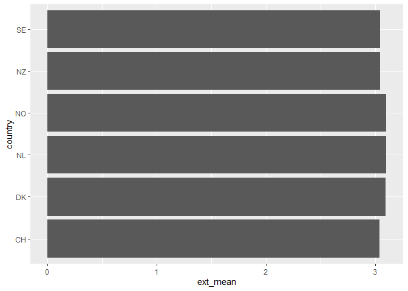
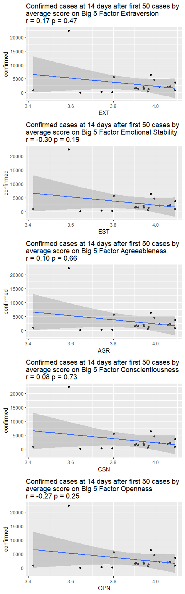
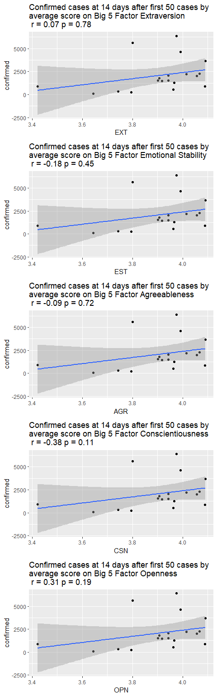

Big5 and COVID19 replication
================
Amit Levinson
3/23/2020

#### Introduction

As part of [Almog Simchon](https://almogsi.com/) “Psychological Data
Science Lab”, he asked participants to try and replicate [Tyler Burleigh
fantastic COVID-19 and the Big 5 Personality Test
blogpost](https://tylerburleigh.com/blog/covid-19-and-the-big-5-personality-test/)
in `R`. You can find links to all the data files in his blogpost. I
found parts of it challenging (using a for loop with ggplot) but fun
nonetheless\! I would love to hear comments about the code (for example
moving the for loop to `apply`) or any mistake I might have done.

### Libraries

``` r
library(tidyverse)
library(here)
library(janitor)
```

### Load data

``` r
train <- read_csv(here("02_data/train.csv"))
test <- read_csv(here("02_data/test.csv"))

covid_raw <- train %>% 
  full_join(test, by = c("Country/Region" = "Country/Region", "Date" = "Date")) 

covid19 <- covid_raw %>% 
  select("Id","Country/Region", "Date", "ConfirmedCases") %>% 
  clean_names() %>% 
  # remove duplicates
  distinct(id, date, country_region, confirmed_cases)
```

### Filter

Next we will filter to countries that reached at least 50 cases and had
at least 14 days of data beyond that point.

``` r
covid_mindays <- covid19 %>% 
  filter(confirmed_cases > 50) %>% 
  group_by(country_region) %>% 
  mutate(distinct_dates = n_distinct(date)) %>% 
  filter(distinct_dates >=14) %>% 
  ungroup() %>% 
  select(-distinct_dates)

n_distinct(covid_mindays$country_region)
```

    ## [1] 26

``` r
unique(covid_mindays$country_region)
```

    ##  [1] "Austria"        "Bahrain"        "Belgium"        "China"         
    ##  [5] "Cruise Ship"    "Denmark"        "Egypt"          "France"        
    ##  [9] "Germany"        "Greece"         "Iceland"        "Iran"          
    ## [13] "Iraq"           "Israel"         "Italy"          "Japan"         
    ## [17] "Korea, South"   "Kuwait"         "Malaysia"       "Netherlands"   
    ## [21] "Norway"         "Singapore"      "Spain"          "Sweden"        
    ## [25] "Switzerland"    "United Kingdom"

**Why do I have more countries than Tyler?** That is because I
downloaded the data on March 23, 2020, while the author of the post
downloaded it on March 20, 2020. during these three days some of the
countries discovered more cases which, sadly, made them meet our
criteria.\[1\]

### Compute growth over 14 days

Next I will compute the growth in cases for each country with our start
point being the date they reached 50 confirmed cases (as filtered
before) until the following 14 day following that date.

I an not sure I correctly followed along but at this point the original
post has some sort of index column that was evident in their display.
This column is in the original dataset before we select our columns.
Therefore I will return to that dataset and take the new columns along
with the index.

Now I will look at countries that are represented multiple times,
probably because they are written under different provinces:

``` r
head(covid_mindays[covid_mindays$country_region == "China",])
```

    ## # A tibble: 6 x 4
    ##      id date       country_region confirmed_cases
    ##   <dbl> <date>     <chr>                    <dbl>
    ## 1  4376 2020-01-26 China                       60
    ## 2  4377 2020-01-27 China                       70
    ## 3  4378 2020-01-28 China                      106
    ## 4  4379 2020-01-29 China                      152
    ## 5  4380 2020-01-30 China                      200
    ## 6  4381 2020-01-31 China                      237

``` r
covid19_collapse_province <- covid_mindays %>% 
  group_by(country_region, date) %>% 
  summarise(sum(confirmed_cases))

head(covid19_collapse_province[covid19_collapse_province$country_region == "China",])
```

    ## # A tibble: 6 x 3
    ## # Groups:   country_region [1]
    ##   country_region date       `sum(confirmed_cases)`
    ##   <chr>          <date>                      <dbl>
    ## 1 China          2020-01-22                    444
    ## 2 China          2020-01-23                    444
    ## 3 China          2020-01-24                    602
    ## 4 China          2020-01-25                    958
    ## 5 China          2020-01-26                   1545
    ## 6 China          2020-01-27                   2337

``` r
covid19_df <- covid19_collapse_province %>% 
  group_by(country_region) %>% 
  slice(14) %>% 
  arrange(desc(date)) %>% 
  slice(1)

covid19_df %>% 
  knitr::kable() %>% 
  kableExtra::kable_styling()
```

| country\_region | date       | sum(confirmed\_cases) |
| :-------------- | :--------- | --------------------: |
| Austria         | 2020-03-19 |                  2013 |
| Bahrain         | 2020-03-17 |                   228 |
| Belgium         | 2020-03-19 |                  1795 |
| China           | 2020-02-04 |                 22353 |
| Cruise Ship     | 2020-02-20 |                   634 |
| Denmark         | 2020-03-22 |                  1510 |
| Egypt           | 2020-03-22 |                   327 |
| France          | 2020-03-12 |                  2281 |
| Germany         | 2020-03-13 |                  3675 |
| Greece          | 2020-03-21 |                   530 |
| Iceland         | 2020-03-22 |                   568 |
| Iran            | 2020-03-08 |                  6566 |
| Iraq            | 2020-03-20 |                   208 |
| Israel          | 2020-03-21 |                   883 |
| Italy           | 2020-03-06 |                  4636 |
| Japan           | 2020-02-29 |                   241 |
| Korea, South    | 2020-03-04 |                  5621 |
| Kuwait          | 2020-03-15 |                   112 |
| Malaysia        | 2020-03-19 |                   900 |
| Netherlands     | 2020-03-18 |                  2051 |
| Norway          | 2020-03-17 |                  1463 |
| Singapore       | 2020-02-26 |                    93 |
| Spain           | 2020-03-14 |                  6391 |
| Sweden          | 2020-03-18 |                  1279 |
| Switzerland     | 2020-03-16 |                  2200 |
| United Kingdom  | 2020-03-16 |                  1543 |

Great, now join the country names with country abbreviations (two
letters) using the wikipedia-iso-country-codes.csv. I found this more
suitable, in accordance to the original post, after trying several
attempts with the `{isocodes}`. I only selected the two first columns
which contain the Country and Alpha\_2 code (the two letters) and reset
their names:

``` r
country_code <- read_csv(here("/02_data/Wikipedia-iso-country-codes.csv")) %>% 
  select(1:2) %>% 
  set_names("country_region", "alpha_2")
```

``` r
covid19_df <- covid19_df %>% 
  mutate(alpha_2 = countrycode::countrycode(country_region, origin = "country.name", destination = "iso2c")) %>% 
  left_join(country_code) %>% 
  clean_names()

head(covid19_df)
```

    ## # A tibble: 6 x 4
    ## # Groups:   country_region [6]
    ##   country_region date       sum_confirmed_cases alpha_2
    ##   <chr>          <date>                   <dbl> <chr>  
    ## 1 Austria        2020-03-19                2013 AT     
    ## 2 Bahrain        2020-03-17                 228 BH     
    ## 3 Belgium        2020-03-19                1795 BE     
    ## 4 China          2020-02-04               22353 CN     
    ## 5 Cruise Ship    2020-02-20                 634 <NA>   
    ## 6 Denmark        2020-03-22                1510 DK

## Big Five Personality Data

Now we can bring in the [Big Five personality data from
kaggla](https://www.kaggle.com/tunguz/big-five-personality-test). The
dataset containes 1M answers collected online by [Open
Psychometrics](https://openpsychometrics.org/tests/IPIP-BFFM/) and
consists of the country in which the respondent is located.

``` r
big5 <- read_delim(here("/02_data/data-final.csv"), delim = "\t")
```

I am not too familiar with the Big 5 so I will not try to explain the
underlying factors, positive and negative scales underlying it. You can
read more about it in [Tylers original
post](https://tylerburleigh.com/blog/covid-19-and-the-big-5-personality-test/)
or more in depth at the scale documentation on the [IPIP
website](https://ipip.ori.org/newBigFive5broadKey.htm), also linked from
his post.

### Reverse-coding

Before we begin analyzing the personality test we want to reverse code
some of the variables. To do that we just implement a simple substation
of 6 from every reverse-keyed item:

``` r
# positively_keyed <- c('EXT1', 'EXT3', 'EXT5', 'EXT7', 'EXT9','EST1', 'EST3', 'EST5', 'EST6', 'EST7', 'EST8', 'EST9', 'EST10','AGR2', 'AGR4', 'AGR6', 'AGR8', 'AGR9', 'AGR10','CSN1', 'CSN3', 'CSN5', 'CSN7', 'CSN9', 'CSN10', 'OPN1', 'OPN3', 'OPN5', 'OPN7', 'OPN8', 'OPN9', 'OPN10')

negatively_keyed <- c('EXT2', 'EXT4', 'EXT6', 'EXT8', 'EXT10', 'EST2', 'EST4',  'AGR1', 'AGR3', 'AGR5', 'AGR7',  'CSN2', 'CSN4', 'CSN6', 'CSN8', 'OPN2', 'OPN4', 'OPN6')
```

``` r
big5[,negatively_keyed] <- 6-big5[,negatively_keyed]
```

### Country-Level Big 5 Aggregates

First, I will eliminate countries with not enough observations, having
the cutoff be N = 1000:

``` r
big5_filtered <- big5 %>% 
  group_by(country) %>% 
  filter(n() > 1000)

length(unique(big5_filtered$country))
```

    ## [1] 58

``` r
unique(big5_filtered$country)
```

    ##  [1] "GB"   "MY"   "KE"   "SE"   "US"   "FI"   "PH"   "FR"   "AU"   "IN"  
    ## [11] "CA"   "NL"   "ZA"   "HK"   "BR"   "CH"   "TH"   "IT"   "ES"   "AE"  
    ## [21] "HR"   "GR"   "IE"   "DE"   "PT"   "SG"   "NONE" "RO"   "NO"   "LT"  
    ## [31] "ID"   "BE"   "AT"   "DK"   "PL"   "JP"   "MX"   "TR"   "CO"   "EE"  
    ## [41] "AR"   "HU"   "PK"   "CZ"   "NZ"   "RS"   "IL"   "CL"   "SA"   "VN"  
    ## [51] "EG"   "PE"   "VE"   "RU"   "KR"   "BG"   "CN"   "EC"

### Compute average

This is by no way an efficient way but for now it will have to hold:

``` r
big5_filtered$ext_mean <- rowMeans(big5_filtered[,1:10])
big5_filtered$est_mean <- rowMeans(big5_filtered[,11:20])
big5_filtered$agr_mean <- rowMeans(big5_filtered[,21:30])
big5_filtered$csn_mean <- rowMeans(big5_filtered[,31:40])
big5_filtered$opn_mean <- rowMeans(big5_filtered[,41:50])
```

### Country level averages:

``` r
country_average <- big5_filtered %>% 
  group_by(country) %>% 
  summarise_at(vars(ext_mean:opn_mean), mean, na.rm = T) %>% 
  ungroup()
```

### Let us look at the top level country extraverts:

``` r
country_average %>% 
  select(country, ext_mean) %>% 
  arrange(ext_mean) %>% 
  tail() %>% 
  ggplot()+
  geom_col(aes(x = country, y = ext_mean))+
  coord_flip()
```

<!-- -->

### Merge tables and plot

``` r
merged_tables <- country_average %>%
  inner_join(covid19_df, by = c("country" = "alpha_2"))
```

``` r
merged_tables <- merged_tables %>% 
  select(2:6, everything())

factor_nms <- c('Extraversion', 'Emotional Stability', 'Agreeableness', 'Conscientiousness', 'Openness')
x_nms <- c("EXT", "EST", "AGR", "CSN", "OPN")

plots <- list()

for(i in 1:5) {
  # correlation
  corr <- cor.test(merged_tables$sum_confirmed_cases, merged_tables[[i]])
  cor_size <- format(round(corr$estimate, 2), nsmall = 2)
  cor_p <- format(round(corr$p.value,2),nsmall = 2)
  
  # Plot
  plots[[i]] <- local({
    ggplot(merged_tables, aes(x = merged_tables[[i]], y = sum_confirmed_cases))+
      geom_point()+
      geom_smooth(method = "lm")+
      labs(title = glue::glue("Confirmed cases at 14 days after first 50 cases by \naverage score on Big 5 Factor {factor_nms[i]} \nr = {cor_size} p = {cor_p}"), y = "confirmed", x = glue::glue("{x_nms[i]}"))
  })
 }

cowplot::plot_grid(plotlist = plots, nrow = 5)
```

<!-- -->

China might be an outlier in this case, since that is where the outbreak
started.  
therefore I will create the plots again without china this time around:

``` r
merged_tables_nocn <- merged_tables %>%
  filter(country != "CN")

plots2 <- list()

for(i in 1:5) {
  # correlation
  corr <- cor.test(merged_tables_nocn$sum_confirmed_cases, merged_tables_nocn[[i]])
  cor_size <- format(round(corr$estimate, 2), nsmall = 2)
  cor_p <- format(round(corr$p.value,2),nsmall = 2)
  # Plot
  plots2[[i]] <- local({
    ggplot(merged_tables_nocn, aes(x = merged_tables_nocn[[i]], y = sum_confirmed_cases))+
      geom_point()+
      geom_smooth(method = "lm")+
      labs(title = glue::glue("Confirmed cases at 14 days after first 50 cases by \naverage score on Big 5 Factor {factor_nms[i]}\n r = {cor_size} p = {cor_p}"), y = "confirmed", x = glue::glue("{x_nms[i]}"))
  })
 }

cowplot::plot_grid(plotlist = plots2, nrow = 5)
```

<!-- -->

It seems like only OPN (openness) showed a pattern. Countries with
higher levels of openness saw a higher growth of confirmed cases along
the 14 days.

``` r
merged_tables %>%
  select(country_region, opn_mean, sum_confirmed_cases) %>% 
  arrange(-opn_mean) %>% 
  knitr::kable() %>% 
  kableExtra::kable_styling()
```

<table class="table" style="margin-left: auto; margin-right: auto;">

<thead>

<tr>

<th style="text-align:left;">

country\_region

</th>

<th style="text-align:right;">

opn\_mean

</th>

<th style="text-align:right;">

sum\_confirmed\_cases

</th>

</tr>

</thead>

<tbody>

<tr>

<td style="text-align:left;">

Germany

</td>

<td style="text-align:right;">

4.089598

</td>

<td style="text-align:right;">

3675

</td>

</tr>

<tr>

<td style="text-align:left;">

Israel

</td>

<td style="text-align:right;">

4.088819

</td>

<td style="text-align:right;">

883

</td>

</tr>

<tr>

<td style="text-align:left;">

France

</td>

<td style="text-align:right;">

4.066059

</td>

<td style="text-align:right;">

2281

</td>

</tr>

<tr>

<td style="text-align:left;">

Austria

</td>

<td style="text-align:right;">

4.056052

</td>

<td style="text-align:right;">

2013

</td>

</tr>

<tr>

<td style="text-align:left;">

Switzerland

</td>

<td style="text-align:right;">

4.015059

</td>

<td style="text-align:right;">

2200

</td>

</tr>

<tr>

<td style="text-align:left;">

Italy

</td>

<td style="text-align:right;">

3.991518

</td>

<td style="text-align:right;">

4636

</td>

</tr>

<tr>

<td style="text-align:left;">

Spain

</td>

<td style="text-align:right;">

3.974855

</td>

<td style="text-align:right;">

6391

</td>

</tr>

<tr>

<td style="text-align:left;">

Sweden

</td>

<td style="text-align:right;">

3.965763

</td>

<td style="text-align:right;">

1279

</td>

</tr>

<tr>

<td style="text-align:left;">

Greece

</td>

<td style="text-align:right;">

3.961823

</td>

<td style="text-align:right;">

530

</td>

</tr>

<tr>

<td style="text-align:left;">

Denmark

</td>

<td style="text-align:right;">

3.942429

</td>

<td style="text-align:right;">

1510

</td>

</tr>

<tr>

<td style="text-align:left;">

Netherlands

</td>

<td style="text-align:right;">

3.942170

</td>

<td style="text-align:right;">

2051

</td>

</tr>

<tr>

<td style="text-align:left;">

Norway

</td>

<td style="text-align:right;">

3.916673

</td>

<td style="text-align:right;">

1463

</td>

</tr>

<tr>

<td style="text-align:left;">

Belgium

</td>

<td style="text-align:right;">

3.906212

</td>

<td style="text-align:right;">

1795

</td>

</tr>

<tr>

<td style="text-align:left;">

United Kingdom

</td>

<td style="text-align:right;">

3.901462

</td>

<td style="text-align:right;">

1543

</td>

</tr>

<tr>

<td style="text-align:left;">

Korea, South

</td>

<td style="text-align:right;">

3.801193

</td>

<td style="text-align:right;">

5621

</td>

</tr>

<tr>

<td style="text-align:left;">

Japan

</td>

<td style="text-align:right;">

3.794982

</td>

<td style="text-align:right;">

241

</td>

</tr>

<tr>

<td style="text-align:left;">

Egypt

</td>

<td style="text-align:right;">

3.742885

</td>

<td style="text-align:right;">

327

</td>

</tr>

<tr>

<td style="text-align:left;">

Singapore

</td>

<td style="text-align:right;">

3.643089

</td>

<td style="text-align:right;">

93

</td>

</tr>

<tr>

<td style="text-align:left;">

China

</td>

<td style="text-align:right;">

3.590298

</td>

<td style="text-align:right;">

22353

</td>

</tr>

<tr>

<td style="text-align:left;">

Malaysia

</td>

<td style="text-align:right;">

3.422120

</td>

<td style="text-align:right;">

900

</td>

</tr>

</tbody>

</table>

<br> <br> <br>

-----

### Appendix

#### Benchmarking data.table::fread, read\_delim and read.csv

I initially used `read.csv` to read the big5 file which was slow in
loading and data wrangling. Learning (this past week) about data.table
was a great surprise to see how much faster it loads. I also eventually
figured out to use `read_delim` instead of `read_csv` which eventually
worked with the current data.  
Checkout the benchmarking below (I won’t be running it, see plot below
as image):

``` r
results <- microbenchmark::microbenchmark(
big5_read.csv <- read.csv(here("/02_data/data-final.csv"), head = T, sep = "\t", stringsAsFactors = F),
big5_fread <- fread(here("/02_data/data-final.csv")),
big5_read_csv <- read_delim(here("/02_data/data-final.csv"), delim = "\t"),
times = 10
)
# Plot benchmark
boxplot(results)
# Save
# png(file="saving_plot2.png",
# width=600, height=350)
# boxplot(results, names = c("read.csv", "data.table::fread", "readr::read_delim"), main = "Reading 1.8M row file (10 iterations)", ylab = "seconds")
# dev.off()
```


1.  Actually, this drove me a bit crazy as I was having trouble figuring
    this out. Sometimes you just have to open that csv and give it a
    scroll\!
